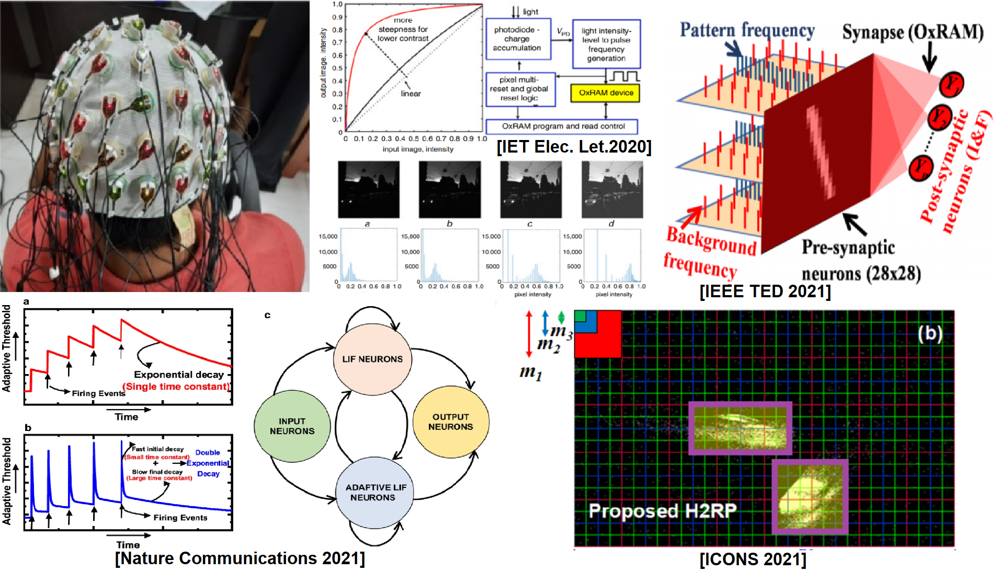

Hi! 

I am Sai Sukruth Bezugam, doctoral student at [Strukov Research Group](https://sites.google.com/site/strukov/) at the University of California, Santa Barbara (UCSB) under the supervision of Prof. Dmitri Strukov. Previously, I received a Master of Science in Research (M.S.(R)) degree from the Electrical Engineering Department at the Indian Institute of Technology Delhi (IITD) while working with [Prof. Manan Suri](https://web.iitd.ac.in/~manansuri/).

I am broadly interested in _Neuromorphic Computing_, _Computational Neuroscience_, _Semiconductor Non-Volatile Memory (NVM) Technology_. My most recent works primarily focus on synaptic learning, neuronal dynamics, spiking neural networks (SNN) device system co-optimization, building SNN on neuromorphic systems, low-processing algorithms for commercial dynamic vision sensors for Neuromorphic applications. In addition, I am always fascinated about whole-brain activity, and I worked on developing a bio-inspired computer vision application that would use brain physiological signals. I have co-authored 5+ publications in prestigious journals and conferences like "Nature Communications, IEEE TED, ICONS" last few years, gaining broader research experience. 

