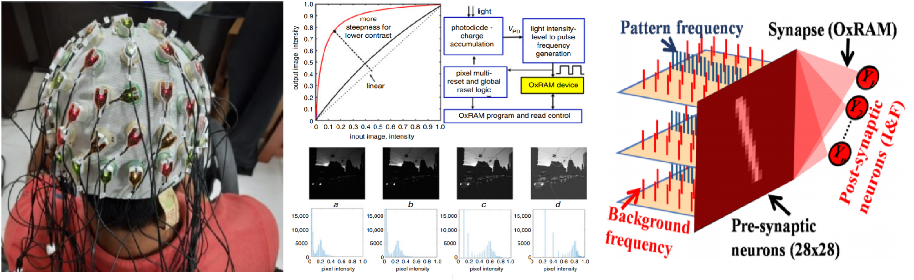

Hello! 

I am Sai Sukruth Bezugam, Master's Reseach Scholar at Electrical Engineering Department, Indian Institute of Technology Delhi (IITD).
My research interests include Neuromorphic Engineering, Computational Neuroscience, Semiconductor Non-Volatile Memory (NVM) Technology. My main work includes Device system co-optimization for Neuromorphic applications. I have co-authored 5+ publications in last 2 years gaining wider research research experience.

